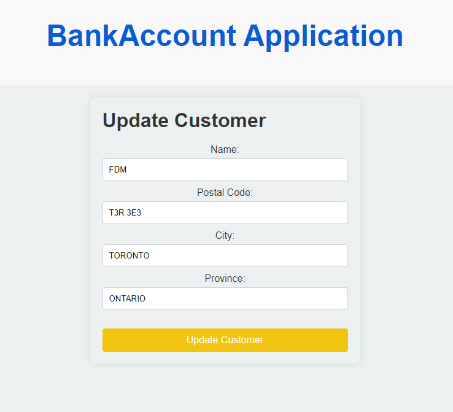

# BankAccount Application

## Overview

This is a React-based web application for managing bank accounts and customers. The application consumes a REST API and provides functionalities for creating, updating, and viewing customers and accounts. The project uses a Spring Boot backend to manage data and provide RESTful endpoints.

## Features

- View all accounts
- Add a new account to a customer
- Update existing accounts
- Delete accounts
- View all customers
- Add new customers
- Update customer details
- Delete customers
- View customer details, including associated accounts

## Prerequisites

- Node.js (v14 or higher)
- npm (v6 or higher)
- Java (JDK 8 or higher)
- Spring Boot (for the backend API)
- Git

## Setup and Running the Application

First thing to do is to get a clone of the project:
  ```
  git clone https://git.fdmgroup.com/Andre.Kleber/accountcustomermanagement_epic5.git
  ```
    
### Backend (Spring Boot)

1. Navigate to the backend folder : 
    ```
    cd <repository-folder>/backend
    ```

2. Run the backend application using Eclipse:

   Run _AccountCustomerMngtSpringApplication.java_ as **Sring Boot App**.

   The backend will start on `http://localhost:8080`.

### Frontend (React)

1. Navigate to the frontend directory:
    ```
    cd <repository-folder>/frontend
    ```

2. Install the dependencies:
    ```
    npm install
    ```
    ```
    npm install react-router-dom
    ```
    ```
    npm install axios
    ```

3. Start the React application:
    ```
    npm start
    ```

   The frontend will start on `http://localhost:3000`.

## Application Pages and Components

### Home (`/`)

- **Component**: `AccountList`
- **Description**: Displays all accounts with functionalities to add a new account to a customer, update existing accounts, and delete accounts.

  

### Add New Account (`/create-account/:customerId`)

- **Component**: `NewAccount`
- **Description**: Provides a form to create a new account for a specified customer. The user can select the account type (savings or checking) and enter the respective details.

  

### Update Account (`/update-account/:id`)

- **Component**: `UpdateAccount`
- **Description**: Allows updating the details of an existing account. Depending on the account type, the user can update the balance, interest rate (for savings), or next check number (for checking).

  

### View All Customers (`/view_all_customers`)

- **Component**: `CustomerList`
- **Description**: Displays a list of all customers with functionalities to update or delete a customer, and also to add an account to a customer.

  

### Add New Customer (`/create-customer`)

- **Component**: `NewCustomer`
- **Description**: Provides a form to create a new customer. The user can select the customer type (person or company) and enter the respective details.

  

### Update Customer (`/update-customer/:customerType/:id`)

- **Component**: `UpdateCustomer`
- **Description**: Allows updating the details of an existing customer (name and address details).

  

### View Customer Details (`/find-customer`)

- **Component**: `FindCustomer`
- **Description**: Provides a form to enter a customer ID and retrieve all customer details, including associated accounts.

  

### Login (`/login`)

- **Component**: `ComingSoon`
- **Description**: Displays a "Coming soon!" message. No further functionality is implemented.

### Register (`/register`)

- **Component**: `ComingSoon`
- **Description**: Displays a "Coming soon!" message. No further functionality is implemented.

## Component Details

### `AccountList` Component

- Fetches and displays all accounts from the backend.
- Provides buttons to update or delete each account.
- Includes a dropdown to select a customer and a button to add a new account for the selected customer.

### `NewAccount` Component

- Provides a form to create a new account.
- Allows the user to select the account type and enter the respective details.
- Sends a POST request to the backend to create the account.

### `UpdateAccount` Component

- Fetches account details by ID and displays them in a form.
- Allows the user to update the account details.
- Sends a PUT request to the backend to update the account.

### `CustomerList` Component

- Fetches and displays all customers from the backend.
- Provides buttons to update or delete each customer, and a button to add an account to a customer.

### `NewCustomer` Component

- Provides a form to create a new customer.
- Allows the user to select the customer type and enter the respective details.
- Sends a POST request to the backend to create the customer.

### `UpdateCustomer` Component

- Fetches customer details by ID and displays them in a form.
- Allows the user to update the customer details.
- Sends a PUT request to the backend to update the customer.

### `FindCustomer` Component

- Provides a form to enter a customer ID.
- Fetches and displays customer details, including associated accounts.

### `ComingSoon` Component

- Displays a "Coming soon!" message for the Login and Register pages.

## Notes

- The frontend and backend should be running on different ports (`3000` for the frontend and `8080` for the backend).


